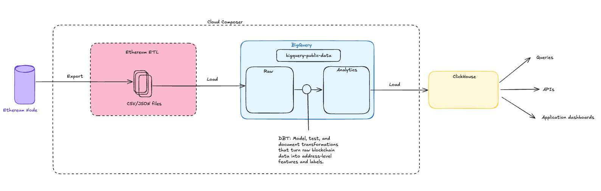

# Ethereum On-Chain Analytics Architecture

## Objective

Design a pipeline that produces **valuable labels for blockchain addresses**. These labels should be useful to investors seeking to better understand on-chain activity and make smarter decisions.

## What Makes a Label Valuable?

A valuable label provides actionable, timely, and interpretable insights about blockchain addresses. For investors, the most useful labels are:

- **Accurate:** Reliably reflect the true behavior or identity of an address.
- **Timely:** Updated frequently enough to capture recent changes or emerging trends.
- **Interpretable:** Easy to understand at a glance, often using clear names or emojis.
- **Actionable:** Enable users to make informed decisions, such as tracking smart traders or identifying sector specialists.

Labels help investors cut through blockchain noise, quickly identify key players, and validate strategies by monitoring wallet activity in real time.

### Sample Labels and Use Cases

- **Emerging Smart Trader:**  
  _Definition:_ An address with PnL comparable to Smart Money but smaller trade sizes.  
  _Investor Use:_ Spot up-and-coming traders to follow or analyze their strategies.

- **Sector Specialist (e.g., AI Specialist):**  
  _Definition:_ A trader consistently profitable in a specific sector, such as AI-related tokens.  
  _Investor Use:_ Identify experts in niche markets for sector-specific insights.

- **Exit Liquidity:**  
  _Definition:_ An address that typically buys the top and tends to be late movers.  
  _Investor Use:_ Avoid following addresses with a history of poor timing.

- **Token Deployer:**  
  _Definition:_ Highlights addresses that have deployed tokens, specifying which ones.  
  _Investor Use:_ Track new token launches and monitor deployer activity.

These labels appear across dashboards, making it easier to monitor trends, validate strategies, and analyze token movements efficiently.

---

## Key Considerations

- **Block Frequency**: Ethereum creates new blocks every 15–20 seconds. While not ultra-high velocity, a micro-batch approach is most suitable.
- **Label Stability**: Address labels, metrics, and metadata change infrequently, as they reflect user behavior that settles over time. Slight latency is acceptable.
- **Dataset Methodology**: The author of `bigquery-public-data.crypto_ethereum` has published their methodology [here](https://cloud.google.com/blog/products/data-analytics/ethereum-bigquery-how-we-built-dataset). Understanding this is valuable for building in-house or cross-chain solutions.

---

## Architecture Overview

| Layer                        | Technology     | Purpose                                                                       |
| :--------------------------- | :------------- | :---------------------------------------------------------------------------- |
| **Ingestion**                | Ethereum ETL   | Exporting the Ethereum blockchain into CSV or JSON files                      |
| **Storage**                  | BigQuery       | Centralized warehouse for raw and transformed data, partitioned and queryable |
| **Transformation & Testing** | dbt            | Incremental transformations, schema testing, and data quality validation      |
| **Serving / Analytics**      | ClickHouse     | Low-latency analytical queries for dashboards and user-facing APIs            |
| **Orchestration**            | Cloud Composer | Workflow scheduling and management                                            |

The architecture is designed for horizontal scalability. Storage and analytics layers (BigQuery, ClickHouse) support partitioning and sharding, allowing the system to handle increasing data volumes by adding more nodes or partitions. This ensures the pipeline remains performant as blockchain activity grows.

---

## Pipeline Flow

### 1. Blockchain Data Ingestion

- Use the open-source tool [Ethereum ETL](https://github.com/blockchain-etl/ethereum-etl).
- Connect to an Ethereum node via JSON RPC.
- Export data to CSV/JSON.
- Orchestrate with Cloud Composer.

> Originally, a pub/sub approach was considered but was deemed overly complex for the given use case.

---

### 2. Storage in BigQuery

- BigQuery acts as both a data lake and a staging warehouse.
- Raw tables store immutable, append-only data.
- Ensures durability, schema enforcement, and replayability.

---

### 3. Transformation with dbt

- Incremental models build enriched, analytics-ready datasets.

**Example Transformation Layers:**

| Layer            | Example Table               | Description                                                        |
| :--------------- | :-------------------------- | :----------------------------------------------------------------- |
| **Staging**      | `stg.transactions`          | Cleaned and standardized fields (addresses, timestamps, decimals). |
| **Intermediate** | `int.token_transfers`       | Joined with token metadata and contract addresses.                 |
| **Analytics**    | `analytics.wallet_activity` | Aggregated wallet-level metrics and behavioral classifications.    |

**Scheduling & Testing:**

- Scheduled dbt runs via Cloud Composer.
- Data integrity is enforced with dbt tests (e.g., no duplicate `tx_hash`, non-null fields, monotonic block order).

---

### 4. Export to ClickHouse

ClickHouse recommends the following approach for exporting data from BigQuery in this [article](https://clickhouse.com/docs/migrations/bigquery/loading-data):

1.  **Export BigQuery table data to GCS** (Google's object store).

    - Use a `BigQueryOperator` in Cloud Composer (Airflow) to run an `EXPORT DATA` statement.
    - Export only new or updated partitions (e.g., last day’s data).
    - Output format: Parquet or CSV in a structured GCS path (e.g., `gs://your-bucket/dt=2025-11-05/`).

2.  **Import data into ClickHouse using the `clickhouse-client`**.

    - Use a `BashOperator` or custom Python operator to trigger a ClickHouse `INSERT INTO ... SELECT` or `clickhouse-client --query` command that loads data from GCS.
    - ClickHouse supports reading from GCS-compatible sources using the S3 table engine or URL table function.

3.  **Validate the load**.

    - Optionally, run a query to compare counts or hashes (e.g., number of rows in ClickHouse vs. BigQuery for that partition).
    - If validation passes, update a `last_synced_date` variable in Composer (XCom or GCS file).

4.  **Schedule in Cloud Composer**.
    - Schedule this DAG to run daily/hourly, depending on how often new BigQuery data arrives.
    - Cloud Composer handles retries, logging, and orchestration automatically.

---

### 5. Serving Layer: ClickHouse

ClickHouse serves as the high-performance analytical layer:

- Enables low-latency dashboards and real-time wallet behavior analytics.
- Powers internal monitoring tools, public APIs, and Smart Money dashboards.
- Ideal for workloads requiring fast aggregation or an extremely high number of queries, such as client-facing dashboards.

**Example Use Cases:**

- Identify "Emerging Smart Traders" or "Sector Specialists."
- Power interactive dashboards for wallet profiling and label updates.

### 6. Monitoring & Alerting

## Pipeline health is monitored using Cloud Composer’s built-in logging and alerting features. Failures or anomalies in data ingestion, transformation, or export trigger automated alerts, enabling rapid response and minimizing downtime.

## Diagram

---

## Milestones & Task Breakdown

### MVP (Minimum Viable Product)

1. **Blockchain Data Ingestion**

   - Set up Ethereum ETL to extract raw blockchain data.
   - Load data into BigQuery for centralized storage.

2. **Basic Data Transformation**

   - Implement dbt models for cleaning and standardizing transaction data.
   - Create staging and intermediate tables.

3. **First Label Generation**

   - Develop logic for a simple, high-value label (e.g., "Token Deployer" or "Emerging Smart Trader").
   - Store and surface these labels in BigQuery.

4. **Serving Layer Integration**

   - Export labeled data to ClickHouse.
   - Build a basic dashboard or API endpoint to display labeled addresses.

5. **Monitoring & Alerting**
   - Set up basic pipeline health checks and alerting in Cloud Composer.

---

## Future Improvements

- **Real-Time Ingestion with Pub/Sub:**  
  Transition from micro-batch to real-time data ingestion by integrating Google Cloud Pub/Sub. This would allow streaming of new Ethereum blocks and transactions as events, enabling lower-latency updates and more timely label generation.

- **Event-Driven Architecture:**  
  Adopt an event-driven approach where data processing and label updates are triggered by blockchain events. This could involve using Pub/Sub topics, leveraging Dataflow for stream processing, and implementing event-based triggers.

- **Cross-Chain Support:**  
  Extend the pipeline to support additional blockchains by abstracting the ingestion and transformation layers.

- **Automated Label Feedback Loop:**  
  Incorporate user or analyst feedback to refine and improve label accuracy over time.

- **Enhanced Data Quality Monitoring:**  
  Add automated anomaly detection and alerting for data quality issues in the pipeline.

---

**Author:** Connor McDonald  
**Date:** November 2025
